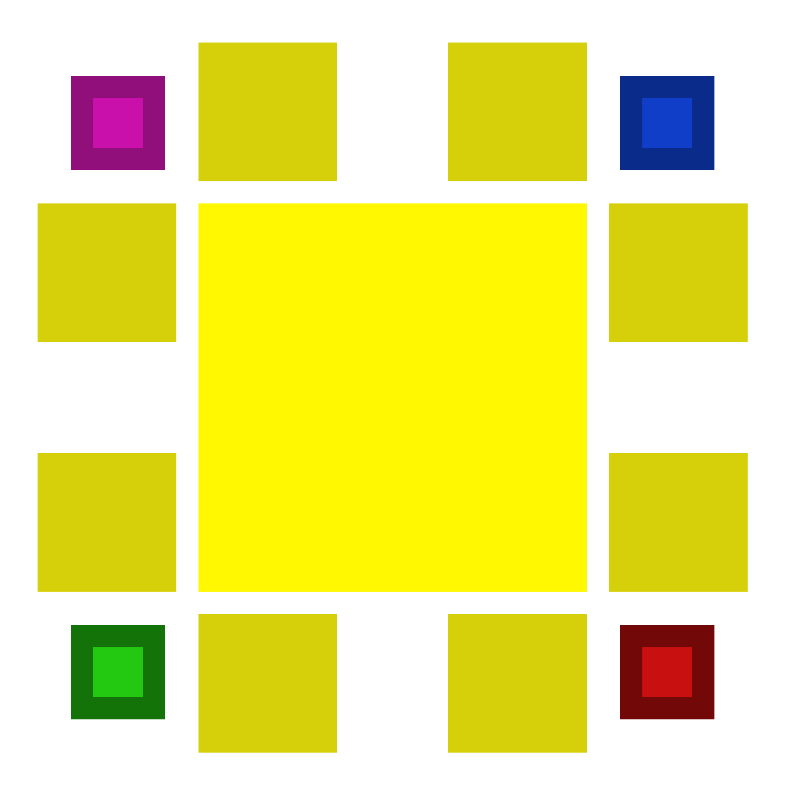

[![Contributors][contributors-shield]][contributors-url]
[![Stargazers][stars-shield]][stars-url]
[![Issues][issues-shield]][issues-url]
[![LinkedIn][linkedin-shield]][linkedin-url]
<!-- [![MIT License][license-shield]][license-url]
     [![Forks][forks-shield]][forks-url] -->


<!-- PROJECT LOGO -->
<br />
<div align="center">
  <a href="https://github.com/Multipixels/Keep-Talking-and-Nobody-Explodes-Bot">
    
  </a>

<h3 align="center">Keep Talking and Nobody Explodes Bot</h3>

  <p align="center">
    A KTaNE assistant for when you're alone.
    <br />
    <a href="https://github.com/Multipixels/Keep-Talking-and-Nobody-Explodes-Bot/wiki"><strong>Explore the docs »</strong></a>
    <br />
    <a href="https://youtu.be/qaytGFiAcFE">View Video Demo</a>
    ·
    <a href="https://github.com/Multipixels/Keep-Talking-and-Nobody-Explodes-Bot/issues">Report Bug</a>
    ·
    <a href="https://github.com/Multipixels/Keep-Talking-and-Nobody-Explodes-Bot/issues">Request Feature</a>
  </p>
</div>


<!-- TABLE OF CONTENTS -->
<details>
  <summary>Table of Contents</summary>
  <ol>
    <li>
      <a href="#about-the-project">About The Project</a>
      <ul>
        <li><a href="#built-with">Built With</a></li>
      </ul>
    </li>
    <li>
      <a href="#getting-started">Getting Started</a>
      <ul>
        <li><a href="#prerequisites">Prerequisites</a></li>
        <li><a href="#installation">Installation</a></li>
      </ul>
    </li>
    <li><a href="#usage">Usage</a></li>
    <li><a href="#roadmap">Roadmap</a></li>
    <!--<li><a href="#contributing">Contributing</a></li>-->
    <!--<li><a href="#license">License</a></li>-->
    <li><a href="#contact">Contact</a></li>
    <!--<li><a href="#acknowledgments">Acknowledgments</a></li>-->
  </ol>
</details>


<!-- ABOUT THE PROJECT -->
## About The Project

<!--[![Product Name Screen Shot][product-screenshot]](https://example.com)-->

A high-school project made to help users play [Keep Talking and Nobody Explodes](https://keeptalkinggame.com/) without the need of another player. Simply start up the program and describe the bomb as it tells you which wires to cut or what code to insert.

<p align="right">(<a href="#top">back to top</a>)</p>


### Built With

* [Python](https://www.python.org/)
* [Vosk](https://alphacephei.com/vosk/)

<p align="right">(<a href="#top">back to top</a>)</p>


<!-- GETTING STARTED -->
## Getting Started

Currently tested for Windows only.
Currently tested for Python 3.9 only.

To get a local copy up and running follow these steps.

### Prerequisites

* pip
  ```sh
  pip install --upgrade pip
  ```

### Installation

1. Clone the repo
   ```sh
   git clone https://github.com/Multipixels/Keep-Talking-and-Nobody-Explodes-Bot.git
   ```
2. Install Python package dependencies
   ```sh
   pip install pynput
   pip install pyttsx3
   pip install pyaudio
   pip install vosk
   ```
3. Install a [Vosk Audio Recognition Model](https://alphacephei.com/vosk/models). Put it in the root folder of the repo.
   - The only two models supported are the following.
     - [vosk-model-en-us-0.22-lgraph](vosk-model-en-us-0.22-lgraph), Faster bootup, but provides less accuracy. If having trouble, try using the next model.
     - [vosk-model-en-us-0.22](https://alphacephei.com/vosk/models/vosk-model-en-us-0.22.zip), Provides more accuracy, but initial bootup takes longer and takes up much more space.

<p align="right">(<a href="#top">back to top</a>)</p>

<!-- USAGE EXAMPLES -->
## Usage

Run the main.py file. If installation was done correctly, a window will popup. Wait until it shows "Bot heard: Ready to Listen!"
When you're ready to start, press the "Activate" button below. Press it again if you want to stop.

_Full tutorials will be found [here](https://www.youtube.com/playlist?list=PLll7a_aZOiE63zbNZDA6jSA71DDJmMIG4)._

_For more in-depth details on specific modules and information, please refer to the [Wiki](https://github.com/Multipixels/Keep-Talking-and-Nobody-Explodes-Bot/wiki)._

<p align="right">(<a href="#top">back to top</a>)</p>

<!-- ROADMAP -->
## Roadmap

- [X] Vanilla Modules
    - [X] Complicated Wires
    - [X] Keypad
    - [X] Maze
    - [X] Memory
    - [X] Morse Code
    - [X] Password
    - [X] Simon Says
    - [X] The Button
    - [X] Who's On First
    - [X] Wire Sequence
    - [X] Wires
- [ ] Vanilla Needy Modules
    - [ ] Knob
- [ ] Settings Menu
    - [ ] **C++ Port**
    - [X] Voice activation
    - [ ] Activation by keyword ("Hey Bot...")
    - [ ] Push-to-talk/Toggle Options
    - [ ] Module Settings

<!-- See the [open issues](https://github.com/github_username/repo_name/issues) for a full list of proposed features (and known issues). -->

<p align="right">(<a href="#top">back to top</a>)</p>


<!-- LICENSE -->
<!-- ## License

Distributed under the MIT License. See `LICENSE.txt` for more information.

<p align="right">(<a href="#top">back to top</a>)</p> -->


<!-- CONTACT -->
## Contact

Richard Motorgeanu - richard.motorgeanu@gmail.com

Project Link: [https://github.com/Multipixels/Keep-Talking-and-Nobody-Explodes-Bot](https://github.com/Multipixels/Keep-Talking-and-Nobody-Explodes-Bot)

<p align="right">(<a href="#top">back to top</a>)</p>


<!-- MARKDOWN LINKS & IMAGES -->
<!-- https://www.markdownguide.org/basic-syntax/#reference-style-links -->
[contributors-shield]: https://img.shields.io/github/contributors/Multipixels/Keep-Talking-and-Nobody-Explodes-Bot.svg?style=for-the-badge
[contributors-url]: https://github.com/Multipixels/Keep-Talking-and-Nobody-Explodes-Bot/graphs/contributors
[forks-shield]: https://img.shields.io/github/forks/Multipixels/Keep-Talking-and-Nobody-Explodes-Bot.svg?style=for-the-badge
[forks-url]: https://github.com/Multipixels/Keep-Talking-and-Nobody-Explodes-Bot/network/members
[stars-shield]: https://img.shields.io/github/stars/Multipixels/Keep-Talking-and-Nobody-Explodes-Bot.svg?style=for-the-badge
[stars-url]: https://github.com/Multipixels/Keep-Talking-and-Nobody-Explodes-Bot/stargazers
[issues-shield]: https://img.shields.io/github/issues/Multipixels/Keep-Talking-and-Nobody-Explodes-Bot.svg?style=for-the-badge
[issues-url]: https://github.com/Multipixels/Keep-Talking-and-Nobody-Explodes-Bot/issues
<!-- [license-shield]: https://img.shields.io/github/license/github_username/repo_name.svg?style=for-the-badge -->
<!-- [license-url]: https://github.com/github_username/repo_name/blob/master/LICENSE.txt -->
[linkedin-shield]: https://img.shields.io/badge/-LinkedIn-black.svg?style=for-the-badge&logo=linkedin&colorB=555
[linkedin-url]: https://www.linkedin.com/in/richard-motorgeanu/
[product-screenshot]: images/screenshot.png
